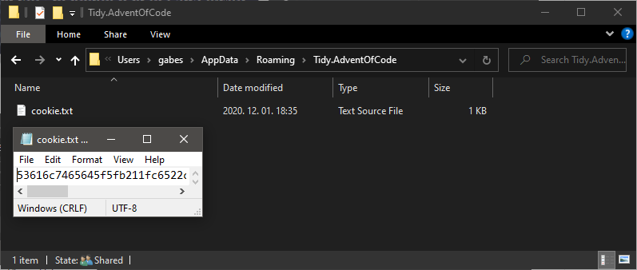

# Tidy.AdventOfCode

*Yo, ho ho!*

`Tidy.AdventOfCode` is a free, simple runner and framework for creating and posting your solutions for the awesome <a href="https://adventofcode.com/" target="_blank">Advent of Code</a> yearly riddle-fest in (the also awesome) .NET!

## What it does

`Tidy.AdventOfCode` provides a framework for running your solutions for Advent of Code riddles, and that means there are predefined types (like `Day<T>`) that help you organize your code or reduce boilerplate. If you follow the example below, you'll see everything will *"just work"*. You add your solution for the day, start the runner (providing the proper `year`, `dayNumber` and `part` values are still your responsibility, maybe use a `Console.ReadLine()` for getting them from the console), and your solution gets automagically calculated for the input that gets pulled (and cached ) from the server. Then, your answer in hand, your solution gets **posted** to the server, and the result from the server gets rendered on your console!

## What's new?

The list of changes can be found at the [release notes](RELEASE_NOTES.md).

## Prerequisites

You need at least <a href="https://dotnet.microsoft.com/download/dotnet/" target="_blank">version 5.0 of the .NET SDK</a> installed. Nothing else. Although a <a href="https://code.visualstudio.com/" target="_blank">code editor</a> or an <a href="https://visualstudio.microsoft.com/" target="_blank">IDE</a> might be a good idea.

## Low maintenance

1. Create a new Console app:

    `> dotnet new console -f net5.0`

2. Add a little Tidy.AdventOfCode NuGet sprinkle:

    `> dotnet add package Tidy.AdventOfCode`

3. Create a default runner (replace `Program.cs`):

    ``` C#
    await Tidy.AdventOfCode.Runner.CreateDefault().ExecuteAsync(); // Yes, one line!
    ```

4. Log in to the <a href="https://adventofcode.com/" target="_blank">Advent of Code</a> site and copy the value of the `session` cookie:

    

5. Save the value in a file at the above directory named `cookie.txt`:

    

6. Create your solution for the day:

    ``` C#
    using System.Linq;
    using Tidy.AdventOfCode;

    namespace YourName.AdventOfCode.Year2020
    {
        class Day1 : Day
        {
            public override object ExecutePart1() => Input.Count(c => c is '(' or ')');
        }
    }

    ```

7. Watch, as *magic* happens!

    `> dotnet run`

## Things to note

~~The biggest issue you might run into is when you submit answers less, than a minute apart each other. In this case, for your consequent calls, the warning message will be cached for your answer (whether it was the right or wrong one). In this case you might need to manually delete the corresponding cache entries (or the cache entirely, if you like).~~ [Not an issue since version 1.2.1.](RELEASE_NOTES.md)

The public API is **fully documented** (it is of good quality too, if I may say so myself), so you can start hacking away as much as you like and find new things to do magic with.

The API is designed in a way to be fully expandable (by inheriting) or to be as easy as possible.

For pros, you can switch out any of the underlying services that are registered in the service provider. `IDay` instances are instantiated using DI.

The Advent of Code server isn't designed to be used this way. Please, be mindful and don't use any of your code for malicious purposes, such as DDOSing the server. You are identified by your IP address (and specifically, by the session cookie), so consider yourself informed.

If you have some questions, feel free to browse the source or open an issue. I don't plan to extend the current solution very much (unless public demand shows to or I happen to get another), so if you wish to modify anything in the framework, feel free to open a pull request or fork the repo.

The cached inputs, answers and responses are all in a human-readable and machine-readable format, so feel free to abuse the cache folder to your liking.

## Pro tips

There are some <a href="https://tyrrrz.me/blog/fluent-generics">fluent generics</a> used to construct differently parsed input-handling `Day<T>` objects, such as `Day<T>.WithParser<TParser>`. Yes, that *is* a **type**! This can reduce boilerplate parsing the input values quite significantly. More info can be found [describing version 2.0.0 of the release notes](RELEASE_NOTES.md).

You can create your own Runner, if you would only like a part of the functionality `Tidy.AdventOfCode` provides. There is also a handy extension method for registering with any `IServiceCollection`, like `services.AddTidyAdventOfCode(...)`.

----

*Keep on hackin'! Click the ⭐!*